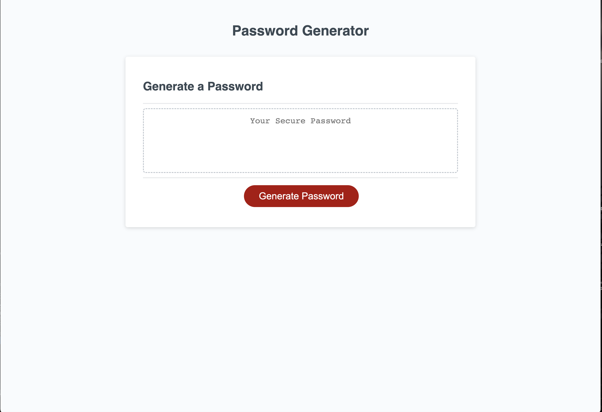

# OSU-Bootcamp-Challenge-3
The JavaScript challenge for the OSU Bootcamp
## Creating a password generator
-For this assignment I started by defining the character sets that would be used to supply the password generator
-After that I set up the generate password function that is called in the pre-existing text
-This is where things started getting messy, as I started by simply creating a for loop that would create a password using the provided character set.
-This only tangentially worked, as the passwords ended up being large blocks of unrandomized text out of the character set
-I continued messing with it until I got it to shrink down in size by adding a length selector and qualifications for what is an acceptable password length.
-The password inputs were still messy, so I played around with arrays and with putting the charset into a larger object to organize the code and get unique answers.
-While I did this, I also added window prompts to ascertain which parts of the charset to add to the pool
-This only mostly worked, as I was getting randomized answers but they were not using anything except for the first characters listed
-I played around with that same for loop for ages before it stopped even giving me passwords.
-After seeking help, I decided to submit what I had and come back to it at a later date.

Screenshot: 

Webpage URL:https://alphastranger.github.io/Password-Generator/